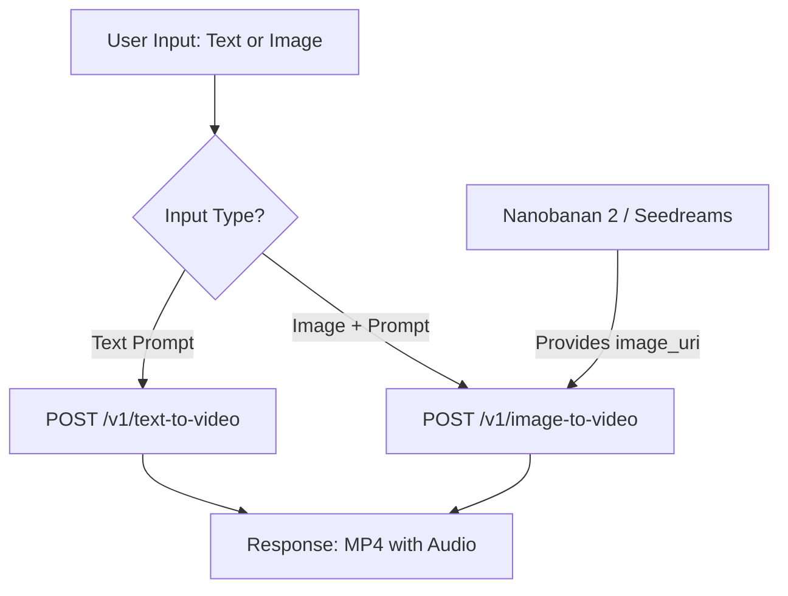

# Project: AI Video Generation from Prompt

## Overview
This project enables users to generate high-quality videos from text descriptions or static images using the [LTX Video Cloud API](https://docs.ltx.video/welcome). Images used for video generation are sourced from **nanobanan 2** and **seedreams** applications.

- **Base URL**: `https://api.ltx.video`
- **Authentication**: Bearer token via `Authorization` header
- **Response**: MP4 video file returned directly (no polling/webhooks)

---

## User Story

**As a** content creator,  
**I want to** generate video clips from my text prompts or existing images generated by nanobanan 2 and seedreams,  
**So that** I can create engaging visual content without requiring manual animation skills.

### Acceptance Criteria:
- The system can take a text prompt and return a video (Text-to-Video).
- The system can take an image (from nanobanan 2 or seedreams) and a motion prompt to return an animated video (Image-to-Video).
- Videos include synchronized audio (dialogue, music, or ambient sound) by default.
- Support for up to 4K resolution and 20-second duration.
- Support for camera motion effects (e.g., pan, zoom, orbit).

---

## Analysis of Implementation

### 1. External Integrations

#### LTX Video API (`https://api.ltx.video`)

| Endpoint | Method | Description |
|---|---|---|
| `/v1/text-to-video` | POST | Generate video from a text prompt |
| `/v1/image-to-video` | POST | Animate a still image with motion |
| `/v1/audio-to-video` | POST | Generate video driven by an audio track |
| `/v1/retake` | POST | Re-generate a section of an existing video |
| `/v1/extend` | POST | Lengthen a video from beginning or end |

**Available Models**:

| Model | Type |
|---|---|
| `ltx-2-fast` | Fast generation, lower quality |
| `ltx-2-pro` | Slower generation, higher quality |
| `ltx-2-3-fast` | Latest fast model |
| `ltx-2-3-pro` | Latest pro model (recommended) |

**Required Parameters** (for text-to-video & image-to-video):

| Parameter | Type | Description |
|---|---|---|
| `prompt` | string | Text description (max 5000 chars) |
| `model` | enum | One of the models above |
| `duration` | integer | Video length in seconds |
| `resolution` | string | e.g. `1920x1080` |

**Optional Parameters**:

| Parameter | Default | Description |
|---|---|---|
| `fps` | 24 | Frames per second |
| `camera_motion` | — | Camera effect (pan, zoom, orbit, etc.) |
| `generate_audio` | true | Include AI-generated audio |
| `image_uri` | — | (image-to-video) Source image URL |
| `last_frame_uri` | — | (image-to-video, ltx-2-3 only) End frame for interpolation |

#### Image Sources
- **Nanobanan 2**: Source of high-quality base images.
- **Seedreams**: Source of stylized or dream-like base images.

### 2. Workflow Diagram


### 3. Technical Requirements
- **Authentication**: Bearer API Key via `Authorization` header; key stored in `.env` file (`LTX_API`).
- **Processing**: Synchronous — one HTTP call returns the MP4 directly. Response headers include `x-request-id` for tracking.
- **Storage**: Temporary storage for generated assets before delivery to the user.

### 4. Challenges & Mitigations
- **Prompt Engineering**: Users need clear instructions to get the best motion from LTX. Prompts are limited to 5000 characters.
- **Quality Consistency**: Different image sources (Nanobanan 2 / Seedreams) may behave differently when animated; implementation should allow for parameter tuning (e.g., motion intensity, `camera_motion`, model selection).
- **Error Handling**: API may return 429 (rate limit), 503 (unavailable), or 504 (timeout). Implement retry logic with exponential backoff.

---

## API Usage Examples

### Text-to-Video
```bash
curl -X POST https://api.ltx.video/v1/text-to-video \
  -H "Authorization: Bearer $LTX_API" \
  -H "Content-Type: application/json" \
  -d '{
    "prompt": "A majestic eagle soaring through clouds at sunset",
    "model": "ltx-2-3-pro",
    "duration": 8,
    "resolution": "1920x1080"
  }' \
  -o video.mp4
```

### Image-to-Video (using image from nanobanan 2 or seedreams)
```bash
curl -X POST https://api.ltx.video/v1/image-to-video \
  -H "Authorization: Bearer $LTX_API" \
  -H "Content-Type: application/json" \
  -d '{
    "image_uri": "https://example.com/nanobanan2-generated.jpg",
    "prompt": "Clouds drifting across the sky as the sun sets slowly",
    "model": "ltx-2-3-pro",
    "duration": 8,
    "resolution": "1920x1080"
  }' \
  -o video.mp4
```

---

## Getting Started

1.  **Obtain API Key**: Sign up at [console.ltx.video](https://console.ltx.video/).
2.  **Environment Setup**: Add your key to the `.env` file.
    ```env
    LTX_API=your_key_here
    ```
3.  **Install Dependencies**:
    ```bash
    python3 -m venv .venv
    source .venv/bin/activate
    pip install -r requirements.txt
    ```
4.  **Generate Images**: Use **nanobanan 2** or **seedreams** to create your starting visuals and place them in `images/`.
5.  **Run Generation**: Use the Python script below or the curl examples above.

`requirements.txt` is currently empty of third-party libraries, so you can also run the script directly with system `python3` if you prefer.

---

## Project Structure

```text
generate_video_from_prompt/
├── images/                 # Source images from nanobanan 2 / seedreams
├── outputs/                # Generated videos
├── scripts/
│   └── generate_video.py   # CLI for text-to-video and image-to-video
├── .env.example
├── README.md
└── requirements.txt
```

## Script Usage

### Text-to-Video
```bash
python3 scripts/generate_video.py text \
  --prompt "A cinematic drone shot over snowy mountains at sunrise" \
  --model ltx-2-3-pro \
  --duration 8 \
  --resolution 1920x1080
```

### Image-to-Video with a local file
```bash
python3 scripts/generate_video.py image \
  --image-path images/scene.png \
  --prompt "Slow camera push-in, soft wind moving the trees" \
  --model ltx-2-3-pro \
  --duration 8 \
  --resolution 1920x1080
```

### Image-to-Video with a public URL
```bash
python3 scripts/generate_video.py image \
  --image-url https://example.com/scene.jpg \
  --prompt "Clouds moving behind the subject while the camera gently pans left" \
  --model ltx-2-3-pro \
  --duration 8 \
  --resolution 1920x1080
```

### Extra Options
- `--output outputs/custom_name.mp4`
- `--prompt-file prompts/scene.txt`
- `--camera-motion pan_left`
- `--fps 24`
- `--no-audio`

The script accepts either a public HTTPS image URL or a local image file. Local files are converted to a supported base64 data URI before the request is sent to LTX.
